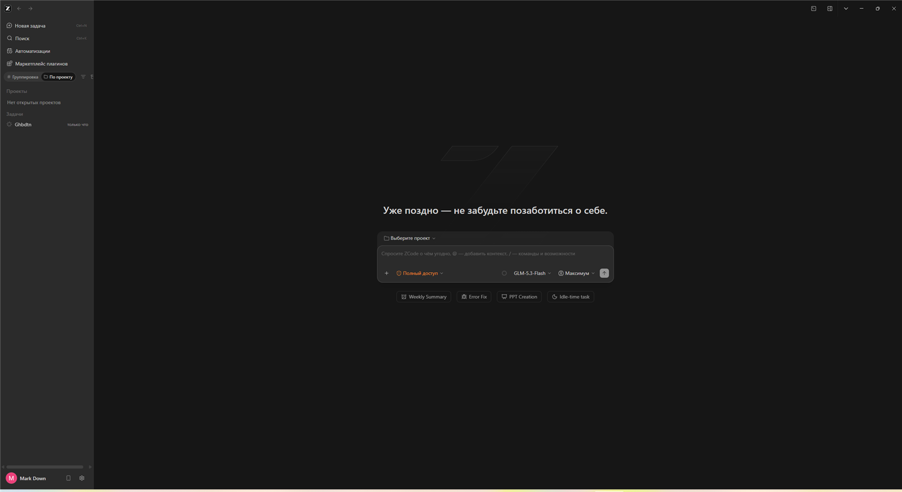

# ZCode Rusifikator 🇷🇺

Полный русский перевод интерфейса настольного приложения [ZCode](https://zcode.z.ai) — ИИ-агента для разработки от Z.ai.

Официально ZCode поддерживает только английский и китайский. Этот проект добавляет **полноценную локаль `ru-RU`**: более **5 000 строк интерфейса** — настройки, чат, Git-панель, плагины, боты, оплата, статистика, служебные окна, нативные меню и трей.



## Возможности

- 🈶 **~5 000 переведённых строк** — практически весь видимый интерфейс;
- 🌐 пункт **«Русский»** в обоих переключателях языка (Настройки и быстрые настройки сайдбара);
- 🔎 **автовыбор языка**: если язык системы русский, интерфейс сразу стартует по-русски;
- 🧩 переводятся также нативные меню, трей, диалог «О программе», панель разрешений Computer Use и монитор процессов;
- 🛡 **безопасная установка**: скрипт пересобирает `app.asar`, пересчитывает integrity-хэши, проверяет побайтовую целостность всех 27 000+ файлов и синтаксис каждого изменённого чанка; при ошибке ничего не подменяется;
- ♻️ **переживает обновления**: после апдейта ZCode достаточно запустить скрипт ещё раз — он найдёт новые строки, сообщит, каких переводов не хватает, и накатит патч заново.

## Требования

| Что | Версия |
|---|---|
| Windows | 10 / 11 |
| ZCode Desktop | 3.x (протестировано на 3.11.2) |
| Node.js | ≥ 18 |

## Установка

### Способ 1 — вручную, одной командой

```cmd
node skill\assets\apply-russian.js
```

Скрипт сам найдёт `app.asar`, проверит всё, соберёт пропатченный архив и установит его. Если ZCode запущен — скрипт поставит фонового помощника: **закройте ZCode (значок в трее → Выход)**, и он сам подменит файл и перезапустит приложение уже по-русски.

### Способ 2 — как навык (skill) ZCode

Скопируйте папку `skill` в пользовательские навыки:

```cmd
xcopy /E /I skill "%USERPROFILE%\.zcode\skills\rusifikator\"
```

После этого в любой сессии ZCode просто скажите агенту: **«накатай русификатор»** — он сам выполнит установку и вернёт перевод после обновлений.

### После установки

Язык выбирается автоматически («Как в системе»). При желании переключите вручную: **Настройки → Язык → Русский** или через быстрые настройки в левом нижнем углу.

## Как это работает

Интерфейс ZCode — веб-рендер внутри Electron, строки интерфейса лежат в каталогах переводов внутри `app.asar` (официально — только `en-US` и `zh-CN`). Скрипт:

1. разбирает заголовок asar-архива;
2. извлекает текущий английский каталог и сверяет со словарём `skill/assets/dict/*.json`;
3. добавляет секцию `ru-RU` во все каталоги (рендерер, меню main-процесса, служебные окна);
4. патчит механизм выбора языка: валидаторы, zod-схемы настроек, системный резолвер и выпадающие списки;
5. пересобирает архив с пересчитанными offset/size/SHA256-integrity и проверяет каждый изменённый файл;
6. подменяет `app.asar` (с автоматическим бэкапом оригинала).

Всё выполняется локально, никакие данные никуда не отправляются.

## После обновления ZCode

Обновление заменяет `app.asar` целиком, и перевод слетает — это нормально:

```cmd
node skill\assets\apply-russian.js
```

Если появились новые строки интерфейса, скрипт создаст `skill/assets/work/missing-keys.json` (ключ → английский текст). Переведите их и добавьте в словарь — или попросите вашего ИИ-агента сделать это.

## Откат

Восстановите оригинальный файл из бэкапа, который скрипт создаёт автоматически:

```cmd
copy /b /y "%LOCALAPPDATA%\Programs\ZCode\resources\app.asar.ru-backup-*" "%LOCALAPPDATA%\Programs\ZCode\resources\app.asar"
```

(предварительно закрыв ZCode).

## FAQ

**Это безопасно?**
Скрипт меняет только локальный файл `app.asar` в вашей установке ZCode, делает бэкап и проверяет целостность каждого файла. Никакого сетевого взаимодействия, никаких телеметрий.

**Слетит ли при обновлении?**
Да, но повторный запуск скрипта возвращает всё на место за минуту.

**Почему не просто файл перевода?**
ZCode пока не имеет системы подключаемых языковых пакетов, поэтому перевод интегрируется прямо в ресурсы приложения.

## English TL;DR

Unofficial full Russian localization for the ZCode desktop app (Electron). The script patches the local `app.asar` bundle: adds a `ru-RU` catalog (~5 000 strings), registers the locale in validators/settings UI, repacks the archive with verified integrity, and installs it with an automatic backup. Re-run it after every ZCode update. Local-only, no network calls.

## Оговорка

Неофициальный проект. Автор не связан с Z.ai / ZCode. ZCode и Z.ai — товарные знаки их владельцев. Перевод предоставляется «как есть», без каких-либо гарантий; используйте на свой риск.

---

Сделано с ❤️ сообществом. Автор: [@Evgen1C](https://github.com/Evgen1C)
